# SATARK (Strategic AI Threat Analysis & Real-time Knowledge)
## Complete Project Documentation, Architecture, Functions & API Reference

---

## 1. Project Overview & Architecture

### What is SATARK?
**SATARK** is an enterprise-grade, intelligence-driven AI News & Information Integrity Platform designed to combat disinformation, filter recycled media, audit political bias, and provide predictive geopolitical & economic roadmaps.

### Key Capabilities
1. **Multi-Source Ingestion & Deduplication**: Aggregates live feeds across Indian and global news wires representing the full ideological spectrum (Left, Center, Right, Public Broadcasters, and Fact Checkers).
2. **Heuristic Credibility & Veracity Scoring**: Evaluates articles on a 0–100 scale using source reputation, cross-verification density across active wires, and clickbait/sensationalism NLP patterns.
3. **Temporal Incident Origin Detection**: Discovers whether a viral news event actually occurred recently or is recycled/stale footage from weeks, months, or years ago.
4. **Ideological Bias Spectrum Profiling**: Maps news outlets and claims onto a calibrated bias spectrum (`-100` Left to `+100` Right) with publisher credentials and social channels.
5. **AI-Powered Truth & Claim Verification**: Couples heuristic rules with Meta Llama 3.3 70B Instruct (via Hugging Face Router) for in-depth claim evaluation, red-flag identification, and actionable verdicts.
6. **"Way Ahead" Strategic Forecasting Chatbot**: Interactive conversational modal enabling users to interrogate any news article regarding multi-stage roadmaps (0–30 days, 1–6 months, 6–24 months), policy implications, scenario risk matrices, and historical precedents.

---

### System Architecture Diagram

```mermaid
graph TD
    subgraph Frontend ["Frontend (React + Vite + TypeScript)"]
        UI[App Layout & Router]
        NAV[Navbar & Category Selector]
        FEED[NewsFeed Grid & Filters]
        VERIFY_UI[VerifyPage & Scanner]
        CHAT_MODAL[WayAheadModal Chatbot]
        GAUGE[VeracityGauge & BiasBar Components]
    end

    subgraph Backend ["Backend (Node.js + Express + TypeScript)"]
        APP[Express App & Global Error Handler]
        ROUTER["API Router (/api)"]
        NEWS_CTRL["fetchNews Controller"]
        VERIFY_CTRL["verifyClaim Controller"]
        WAYAHEAD_CTRL["wayAhead Controller"]
        
        NEWS_SRV["news.service.ts"]
        VERACITY_SRV["veracity.service.ts"]
        BIAS_SRV["bias.service.ts"]
        BIAS_REG["biasRegistry.ts"]
        WAYAHEAD_SRV["wayAhead.service.ts"]
        HF_SRV["hfInference.service.ts"]
        CRON["node-cron (1-Hour Ingestion)"]
    end

    subgraph Storage ["Caching & Persistence"]
        REDIS[Redis Cache / In-Memory Fallback]
    end

    subgraph External ["External Services & Models"]
        RSS_FEEDS["RSS Feeds (PIB, Google News, NDTV, Hindu, Wire, WION, AltNews...)"]
        HF_ROUTER["Hugging Face Router (meta-llama/Llama-3.3-70B-Instruct-Turbo)"]
    end

    %% Frontend to Backend
    FEED -->|GET /api/news| NEWS_CTRL
    VERIFY_UI -->|POST /api/verify| VERIFY_CTRL
    CHAT_MODAL -->|POST /api/way-ahead| WAYAHEAD_CTRL

    %% Backend Routing
    ROUTER --> NEWS_CTRL
    ROUTER --> VERIFY_CTRL
    ROUTER --> WAYAHEAD_CTRL

    %% Controller to Services
    NEWS_CTRL --> NEWS_SRV
    VERIFY_CTRL --> VERACITY_SRV
    VERIFY_CTRL --> BIAS_SRV
    VERIFY_CTRL --> HF_SRV
    VERIFY_CTRL --> NEWS_SRV
    WAYAHEAD_CTRL --> WAYAHEAD_SRV
    WAYAHEAD_SRV --> HF_SRV
    WAYAHEAD_SRV --> NEWS_SRV

    %% Background Ingestion
    CRON --> NEWS_SRV
    NEWS_SRV -->|Fetch Feeds| RSS_FEEDS
    NEWS_SRV --> VERACITY_SRV
    NEWS_SRV --> BIAS_SRV
    NEWS_SRV -->|Store Articles| REDIS
    NEWS_SRV -->|Retrieve Articles| REDIS

    %% AI Calls
    HF_SRV -->|Inference Query| HF_ROUTER
```



---

## 2. Technology Stack

| Layer | Technologies / Libraries |
| :--- | :--- |
| **Frontend Framework** | React 18, Vite, TypeScript |
| **Styling** | Pure Responsive CSS (Mobile: ≤480px, Tablet: ≤768px, Desktop: >768px), Glassmorphic Dark UI |
| **Icons & Visuals** | Lucide React, Canvas-Confetti, Custom SVG Gauges |
| **Backend Framework** | Node.js, Express 4, TypeScript |
| **Feed Ingestion** | `rss-parser`, `cheerio` (for metadata scraping) |
| **Scheduling** | `node-cron` (Automated 1-hour recurring scraping) |
| **Data Caching** | Redis client (`redis` v4) with automatic In-Memory Array fallback |
| **AI Inference** | Hugging Face Router (`https://router.huggingface.co/together/v1/chat/completions`) |
| **AI Model** | `meta-llama/Llama-3.3-70B-Instruct-Turbo` (Temperature controlled ≤ 0.5; default: 0.15–0.2) |

---

## 3. Directory & File Structure

```
news/
├── package.json                        # Root orchestration script (concurrently runs backend + frontend)
├── SATARK_DOCS.md                      # Comprehensive project documentation (this file)
├── backend/
│   ├── .env                            # Backend configuration & Hugging Face token
│   ├── tsconfig.json
│   ├── package.json
│   └── src/
│       ├── app.ts                      # Express app initialization, CORS, middleware, route attachment
│       ├── server.ts                   # Server bootstrap, port listener, Redis init, background cron
│       ├── mapper.ts                   # Legacy mapping utilities
│       ├── config/
│       │   ├── env.ts                  # Strictly validated environment configuration
│       │   ├── biasRegistry.ts         # Database of known news publishers, bias scores (-100 to +100), handles
│       │   ├── mapperRules.ts          # Category keywords for automatic tagging
│       │   ├── trustedSource.ts        # Whitelist of high-credibility news wire publishers
│       │   └── globalError.ts          # AppError class definitions
│       ├── controllers/
│       │   ├── fetchNews.ts            # GET /api/news handler
│       │   ├── verifyClaim.ts          # POST /api/verify handler
│       │   └── wayAhead.controller.ts  # POST /api/way-ahead handler
│       ├── routes/
│       │   └── news.routes.ts          # Express Router definition
│       ├── services/
│       │   ├── news.service.ts         # RSS feed scraping, deduplication, caching, and enrichment
│       │   ├── veracity.service.ts     # Source authority, linguistic analysis, cross-verification, latency
│       │   ├── bias.service.ts         # Bias spectrum assignment based on biasRegistry
│       │   ├── hfInference.service.ts  # Direct HTTP communication with Hugging Face Llama-3.3-70B API
│       │   └── wayAhead.service.ts     # Orchestration of predictive chat, historical lookup & fallback NLP
│       ├── types/
│       │   ├── index.ts
│       │   └── newsItem.ts             # Domain models (NewsItem, VeracityInfo, BiasInfo, WayAheadInfo)
│       └── globalErrorHandler/
│           └── index.ts                # Express global error handler middleware
│
└── frontend/frontend-news/
    ├── index.html                      # Main HTML page
    ├── tsconfig.json
    ├── vite.config.ts
    └── src/
        ├── main.tsx                    # React DOM root render
        ├── App.tsx                     # Top-level view routing (Feed vs Verify)
        ├── App.css                     # Global app styles
        ├── index.css                   # CSS tokens, reset, typography, fluid viewport breakpoints
        ├── types/                      # Frontend TypeScript interfaces
        └── component/
            ├── navbar.tsx & .css       # Header, responsive category tabs, Verify action button
            ├── newsfeed.tsx & .css     # Main news feed grid, search & veracity/bias filter chips
            ├── VerifyPage.tsx & .css   # Interactive claim/URL/media credibility verification scanner
            ├── WayAheadModal.tsx & .css# Interactive Llama-powered predictive chatbot modal
            ├── TruthScannerBox.tsx & .css # Inline news card scanner tool
            ├── VeracityGauge.tsx & .css# Visual 0-100 credibility SVG gauge & metric breakdowns
            ├── BiasSpectrumBar.tsx & .css # -100 to +100 political bias indicator bar
            ├── IncidentTimelineBadge.tsx & .css # Badge showing origin vs published date latency
            └── VigilLogo.tsx & .css    # SATARK shield logo component
```

---

## 4. Detailed Function & Service Documentation

### A. Backend Services (`backend/src/services/`)

#### 1. `news.service.ts`
*Responsible for ingesting external news feeds, parsing content, caching, and orchestrating enrichment.*

- **`initRedis(): Promise<void>`**
  - **Purpose**: Connects to the Redis instance specified in `env.redisUrl`. If the Redis connection fails or times out, it gracefully falls back to an in-memory array (`memoryCache`) without crashing the server.
- **`scrapeAndCacheNews(): Promise<NewsItem[]>`**
  - **Purpose**: Gathers RSS feeds concurrently from across the political and editorial spectrum:
    - *National / Institutional*: PIB, DD News, The Hindu, The Print
    - *Left / Progressive*: The Wire, Scroll.in, NDTV
    - *Right / Conservative*: WION, Firstpost, OpIndia, Swarajya
    - *Aggregators & Trends*: Google News India, Google Trends India, Alt News Fact Check
  - **Workflow**:
    1. Fetches feeds via `fetchRSS()`.
    2. Deduplicates by article URL.
    3. Executes `enrichNewsWithVeracity()` to compute credibility and temporal metrics.
    4. Executes `enrichNewsWithBias()` to compute ideological alignment.
    5. Sorts articles by credibility and publication timestamp.
    6. Stores the result in Redis (key: `defnews:articles`) and in `memoryCache`.
- **`getCachedNews(): Promise<NewsItem[]>`**
  - **Purpose**: High-speed retrieval of cached, enriched news articles. Queries Redis first; if unavailable, returns the in-memory cache.
- **`determineCategory(title: string, snippet: string): NewsItem['category']`**
  - **Purpose**: Analyzes the title and description against keyword dictionaries (`CATEGORY_KEYWORDS`) to categorize articles into `trending`, `national`, `international`, `business`, `technology`, or `Defence`.
- **`extractFirstImage(item: any): string`**
  - **Purpose**: Extracts thumbnail or media URLs from RSS fields (`media:content`, `media:thumbnail`, `enclosure`, or HTML `` tags), falling back to high-resolution category placeholders.

---

#### 2. `veracity.service.ts`
*Responsible for credibility heuristics, clickbait detection, multi-source corroboration, and temporal recycling analysis.*

- **`calculateSourceAuthority(source: string, title: string, description: string): number`**
  - **Purpose**: Computes a 0–100 reputation score based on whether the publisher is a primary news wire, an official government agency (e.g., PIB), an accredited mainstream publisher, an independent blog, or unverified social media.
- **`analyzeContentReliability(title: string, description: string, source: string): { score: number; explanation: string }`**
  - **Purpose**: Uses NLP heuristics to detect sensationalism, clickbait, and hyperbolic phrasing (e.g., ALL CAPS words, excessive exclamation marks, emotional triggers like *"SHOCKING"*, *"UNBELIEVABLE"*, *"EXPOSED"*).
  - **Returns**: A reliability score (0–100) and a human-readable explanation of detected linguistic patterns.
- **`calculateCrossVerification(articles: Array<{ title: string; source: string }>): number[]`**
  - **Purpose**: Analyzes the current batch of articles to calculate how many distinct news organizations are covering the same event. Generates a corroboration multiplier for each article.
- **`extractIncidentOrigin(title: string, description: string, publishedDateIso: string): IncidentOriginInfo`**
  - **Purpose**: Detects recycled or misattributed viral content.
  - **Algorithm**: Scans headlines and descriptions for specific date mentions (e.g., *"on July 14"*, *"in 2021"*, *"last month"*, *"three days ago"*). Calculates the difference between the detected event date and the article publish date (`latencyDays`).
  - **Detection Logic**:
    - `latencyDays >= 14`: Flags article with a recycled content alert.
    - `latencyDays >= 2`: Flags as a prior event reported with delay.
    - `latencyDays < 2`: Flags as fresh/real-time coverage.
- **`enrichNewsWithVeracity(articles: NewsItem[]): NewsItem[]`**
  - **Purpose**: Runs all above veracity and temporal checks over an array of articles, synthesizing the composite `veracity` score:
    $$\text{Score} = (0.45 \times \text{SourceAuthority}) + (0.30 \times \text{CrossVerification}) + (0.25 \times \text{ContentReliability})$$

---

#### 3. `bias.service.ts` & `biasRegistry.ts`
*Responsible for assessing publisher and article political/ideological alignment.*

- **`lookupSourceProfile(sourceName: string, textContext: string): SourceProfile`**
  - **Purpose**: Queries the internal registry of over 50 Indian and international news publishers to retrieve their historical bias score:
    - `-100 to -60`: Far-Left / Left Progressive (e.g., The Wire, Caravan)
    - `-59 to -20`: Center-Left / Moderate Liberal (e.g., The Hindu, Scroll, NDTV)
    - `-19 to +19`: Center / Balanced / Wire (e.g., PIB, DD News, Reuters, PTI)
    - `+20 to +59`: Center-Right / Nationalist / Conservative (e.g., Swarajya, Firstpost)
    - `+60 to +100`: Right / Conservative (e.g., OpIndia)
  - **Returns**: Leaning category, numerical score, official Twitter handle, YouTube channel, and editorial profile.
- **`evaluateArticleBias(article: { source: string; title: string; description: string }): BiasInfo`**
  - **Purpose**: Evaluates a single article and packages its `BiasInfo` structure.
- **`enrichNewsWithBias(articles: NewsItem[]): NewsItem[]`**
  - **Purpose**: Maps over an article array and attaches `bias` metadata to each item.

---

#### 4. `hfInference.service.ts`
*Responsible for direct AI model interactions with Hugging Face's OpenAI-compatible Router endpoint.*

- **`chatWithWayAheadAI(payload: ChatPayload): Promise<{ content: string; modelUsed: string } | null>`**
  - **Purpose**: Powers the interactive Way Ahead strategic chatbot.
  - **Model**: `meta-llama/Llama-3.3-70B-Instruct-Turbo` via Together provider.
  - **Temperature**: `0.2` (enforcing factual, low-hallucination analysis).
  - **Prompt Engineering**: Injects the target headline, summary, category, publisher, and cross-referenced historical feed articles as context. Enforces multi-phase timelines (0–30d, 1–6m, 6–24m), implications, and scenario analysis.
  - **Resilience**: Features an `AbortController` 14-second timeout and fails gracefully to heuristic fallbacks if offline.
- **`analyzeClaimWithAI(payload: VerifyClaimPayload): Promise<AIVerifyResult | null>`**
  - **Purpose**: Evaluates unverified claims, social media posts, URLs, or documents submitted by users.
  - **Model**: `meta-llama/Llama-3.3-70B-Instruct-Turbo`.
  - **Temperature**: `0.15`.
  - **Enforced Output**: Strict JSON format containing `credibility_score` (0–100), `verdict`, `reasoning`, `red_flags` array, and `recommendation`.
  - **Parallel Execution**: Called alongside heuristic algorithms in `verifyClaim.ts` for instantaneous, hybrid verification.

---

#### 5. `wayAhead.service.ts`
*Coordinates the Way Ahead predictive module.*

- **`findRelatedHistoricalArticles(title: string, category?: string): Promise<NewsItem[]>`**
  - **Purpose**: Searches the cached feed archive for previous stories related to the current query by matching keywords and categories.
- **`handleWayAheadChat(params: PredictiveChatParams): Promise<WayAheadChatResponse>`**
  - **Purpose**: Orchestrates the chatbot flow. First queries `chatWithWayAheadAI()`. If the AI model is unreachable or rate-limited, it automatically routes the prompt to an intelligent rule-based NLP fallback engine that constructs:
    - Strategic Policy Implications (Short-Term vs Long-Term)
    - Historical Context & Feed Archive Match Table
    - Scenario Forecasting Matrix (Baseline, Upside, Downside Risk)
    - Multi-Phase Operational Roadmap (Phase 01, 02, 03)

---

### B. Backend Controllers (`backend/src/controllers/`)

- **`fetchNews(req: Request, res: Response, next: NextFunction)`**
  - Reads cached news from `news.service.ts`.
  - Filters by category if `?category=` is provided in the query.
  - Returns JSON array of `NewsItem`.
- **`verifyClaim(req: Request, res: Response, next: NextFunction)`**
  - Accepts text claims, URLs, or media file descriptions.
  - Resolves metadata if a URL is provided.
  - Computes source authority, corroboration count against live feed, and content quality.
  - Dispatches parallel AI analysis to `analyzeClaimWithAI()`.
  - Returns unified verification report.
- **`getWayAheadAnalysis(req: Request, res: Response, next: NextFunction)`**
  - Accepts article details and conversation message history.
  - Delegates to `handleWayAheadChat()` and returns structured response.

---

### C. Frontend Components (`frontend/frontend-news/src/component/`)

| Component | File | Description & Use Case |
| :--- | :--- | :--- |
| **`App.tsx`** | `App.tsx` | Main application shell. Controls top-level navigation between the News Feed view and the dedicated Verify Workbench view. |
| **`Navbar`** | `navbar.tsx` | Fixed header with SATARK branding, category navigation tabs (`Trending`, `National`, `International`, `Business`, `Tech`, `Defence`), and quick action buttons. Fully responsive with mobile horizontal scrolling. |
| **`NewsFeed`** | `newsfeed.tsx` | Main news card feed. Supports real-time full-text search, category selection, veracity threshold filtering (All vs Verified Only), and ideological bias filtering. |
| **`VerifyPage`** | `VerifyPage.tsx` | Dedicated full-page credibility workbench. Accepts Text, URL, or Media uploads. Renders veracity gauge, incident timeline, bias bar, intelligence risk flags, corroborated reports, and AI Analysis verdict. |
| **`WayAheadModal`** | `WayAheadModal.tsx` | Full-featured conversational modal chatbot. Allows users to chat directly with Llama 3.3 70B regarding the future roadmap, implications, scenario forecasts, and past occurrences of any news item. |
| **`TruthScannerBox`** | `TruthScannerBox.tsx` | Compact, inline veracity scanner widget embedded in news cards or quick toolbars. |
| **`VeracityGauge`** | `VeracityGauge.tsx` | Custom SVG radial gauge displaying the 0–100 credibility score with color-coded status badges and detailed 3-pillar breakdown. |
| **`BiasSpectrumBar`** | `BiasSpectrumBar.tsx` | Visual spectrum meter (`-100` Left to `+100` Right) indicating publisher bias, classification labels, and linked Twitter/YouTube handles. |
| **`IncidentTimelineBadge`** | `IncidentTimelineBadge.tsx` | Displays event occurrence date vs publication date, alerting users to recycled or archival footage. |
| **`VigilLogo`** | `VigilLogo.tsx` | High-definition SVG shield logo for SATARK branding. |

---

## 5. Complete API Endpoint Reference

### Base URL
- **Local Development**: `http://localhost:5001/api`
- **Configurable via**: `FRONTEND_URL` and `VITE_API_URL`

---

### Endpoint 1: Fetch News Feed
Fetches aggregated, categorized, veracity-scored, and bias-profiled news articles.

- **Method**: `GET`
- **Path**: `/api/news`
- **Query Parameters**:
  | Parameter | Type | Required | Description |
  | :--- | :--- | :--- | :--- |
  | `category` | `string` | Optional | Filter by category: `trending`, `national`, `international`, `business`, `technology`, `Defence`. If omitted, returns all articles. |

- **Success Response (`200 OK`)**:
  ```json
  [
    {
      "id": "https://pib.gov.in/PressReleasePage.aspx?PRID=...",
      "title": "Cabinet approves major strategic infrastructure initiative",
      "description": "The Union Cabinet chaired by the Prime Minister today approved...",
      "source": "PIB",
      "isTrusted": true,
      "category": "national",
      "publishedAt": "2026-09-20T10:30:00.000Z",
      "url": "https://pib.gov.in/PressReleasePage.aspx?PRID=...",
      "imageUrl": "https://images.unsplash.com/photo-1532375810709-75b1da00537c?...",
      "veracity": {
        "score": 94,
        "label": "Verified Authentic",
        "breakdown": {
          "sourceAuthority": 98,
          "crossVerification": 90,
          "contentAnalysis": 95
        },
        "explanation": "High linguistic objectivity; verified institutional primary publisher."
      },
      "incidentOrigin": {
        "originDate": "2026-09-20T10:30:00.000Z",
        "formattedOriginDate": "Sep 20, 2026",
        "publishedDate": "2026-09-20T10:30:00.000Z",
        "latencyDays": 0,
        "latencyLabel": "Fresh / Real-time event context",
        "confidence": "extracted"
      },
      "bias": {
        "leaning": "center",
        "score": 0,
        "label": "Center / Official Press Wire",
        "sourceType": "wire",
        "description": "Press Information Bureau - Government of India primary news source",
        "twitterHandle": "@PIB_India",
        "youtubeChannel": "PIBIndia"
      }
    }
  ]
  ```

- **Error Responses**:
  - `404 Not Found`:
    ```json
    {
      "success": false,
      "error": "No news articles found in cache",
      "code": "CACHE_EMPTY"
    }
    ```

- **Example `curl`**:
  ```bash
  curl -X GET "http://localhost:5001/api/news?category=Defence"
  ```

---

### Endpoint 2: Verify Claim / Media / URL
Evaluates any user-provided claim, article text, external web URL, or media submission for veracity, political bias, temporal latency, and AI fact-check assessment.

- **Method**: `POST`
- **Path**: `/api/verify`
- **Request Headers**:
  - `Content-Type: application/json`

- **Request Body Parameters**:
  | Field | Type | Required | Description |
  | :--- | :--- | :--- | :--- |
  | `text` | `string` | Optional | Claim statement, article headline, or full text to analyze. |
  | `url` | `string` | Optional | Target URL to scrape and evaluate (supports YouTube, X, news sites). |
  | `type` | `string` | Optional | Submission format: `'text'`, `'url'`, or `'media'` (default: `'text'`). |
  | `mediaName` | `string` | Optional | Filename if evaluating uploaded imagery or video documentation. |

  *(Note: At least one of `text` or `url` should be supplied).*

- **Request Body Example**:
  ```json
  {
    "type": "text",
    "text": "Breaking: Ministry announces new quantum computing roadmap starting next month."
  }
  ```

- **Success Response (`200 OK`)**:
  ```json
  {
    "success": true,
    "inputType": "text",
    "analyzedHeadline": "Breaking: Ministry announces new quantum computing roadmap...",
    "analyzedSource": "Independent / Unverified Submission",
    "veracity": {
      "score": 76,
      "label": "Likely Real",
      "breakdown": {
        "sourceAuthority": 50,
        "crossVerification": 90,
        "contentAnalysis": 88
      },
      "explanation": "Neutral objective framing detected; cross-corroborated with active news wires."
    },
    "incidentOrigin": {
      "originDate": "2026-09-21T00:00:00.000Z",
      "formattedOriginDate": "Sep 21, 2026",
      "publishedDate": "2026-09-21T00:12:00.000Z",
      "latencyDays": 0,
      "latencyLabel": "Fresh / Real-time event context detected.",
      "confidence": "extracted"
    },
    "bias": {
      "leaning": "center",
      "score": 0,
      "label": "Center / Unspecified",
      "sourceType": "independent_journalist"
    },
    "riskFlags": [
      "⚡ Fresh / Real-time event context detected.",
      "✅ Corroborated with 2 active coverage reports in SATARK network."
    ],
    "aiAnalysis": {
      "credibilityScore": 82,
      "verdict": "LIKELY REAL",
      "reasoning": "Matches active coverage across national science initiatives; statement exhibits factual structure without emotional inflation.",
      "redFlags": [
        "Lacks direct executive order gazette notification citation."
      ],
      "recommendation": "Consult the official Ministry portal for tender timelines.",
      "modelUsed": "Llama (Llama-3.3-70B-Instruct-Turbo)"
    },
    "matchedArticles": [
      {
        "id": "https://...",
        "title": "Government unveils National Quantum Mission milestones",
        "source": "The Hindu",
        "url": "https://...",
        "veracity": { "score": 92, "label": "Verified Authentic" }
      }
    ],
    "verdictSummary": "SATARK AI: Matches active coverage across national science initiatives. Source classified as Center / Unspecified."
  }
  ```

- **Example `curl`**:
  ```bash
  curl -X POST "http://localhost:5001/api/verify" \
       -H "Content-Type: application/json" \
       -d '{"type":"text","text":"Scientists develop high-efficiency solar cells with 35% yield."}'
  ```

---

### Endpoint 3: Way Ahead Predictive AI Chatbot
Engages with the strategic AI intelligence chatbot to forecast outcomes, analyze policy implications, explore scenario forecasts, or investigate historical precedents of a news story.

- **Method**: `POST`
- **Path**: `/api/way-ahead`
- **Request Headers**:
  - `Content-Type: application/json`

- **Request Body Parameters**:
  | Field | Type | Required | Description |
  | :--- | :--- | :--- | :--- |
  | `title` | `string` | Required* | Headline or title of the story being analyzed. |
  | `description` | `string` | Optional | Summary or body text of the article. |
  | `category` | `string` | Optional | Topic domain (`national`, `Defence`, `business`, etc.). |
  | `source` | `string` | Optional | Originating publisher name. |
  | `customQuery` | `string` | Optional | One-off question prompt (if not using `messages`). |
  | `messages` | `Array<{role: string, content: string}>` | Optional | Multi-turn chat message history (`role`: `'user'` \| `'assistant'`). |

  *(*If `title` is absent, `customQuery` or `messages` can be provided).*

- **Request Body Example**:
  ```json
  {
    "title": "India signs major bilateral trade deal with European Free Trade Association",
    "description": "Agreement unlocks $100 billion in investment over 15 years and reduces tariffs on precision engineering.",
    "category": "business",
    "source": "The Hindu",
    "messages": [
      {
        "role": "user",
        "content": "What are the strategic implications and the Way Ahead roadmap for this agreement?"
      }
    ]
  }
  ```

- **Success Response (`200 OK`)**:
  ```json
  {
    "success": true,
    "reply": "### 🚀 Strategic Roadmap & Way Ahead\n\n**Phase 01: Immediate Phase (0–30 Days)**\n- Parliamentary ratification reviews and tariff schedule notifications.\n- Inter-ministerial joint steering committee formation.\n\n**Phase 02: Mid-Term Trajectory (1–6 Months)**\n- Phased duty concessions on swiss precision equipment, machinery, and pharma.\n- Bilateral investment facilitation desk launch.\n\n**Phase 03: Long-Term Impact (6–24 Months)**\n- Targeted FDI inflows toward green-tech manufacturing clusters.\n- Enhanced supply chain integration reducing single-source dependencies.",
    "modelUsed": "Llama (Llama-3.3-70B-Instruct-Turbo)",
    "relatedArticlesCount": 3
  }
  ```

- **Example `curl`**:
  ```bash
  curl -X POST "http://localhost:5001/api/way-ahead" \
       -H "Content-Type: application/json" \
       -d '{
         "title": "Defense Ministry clears acquisition of naval maritime patrol drones",
         "category": "Defence",
         "messages": [{"role": "user", "content": "What is the expected timeline and risk scenario?"}]
       }'
  ```

---

## 6. Configuration & Environment Variables

All configuration is centralized and validated in `backend/src/config/env.ts`.

### Backend `.env` (`backend/.env`)

| Variable Name | Required | Default / Example | Purpose |
| :--- | :--- | :--- | :--- |
| `PORT` | No | `5001` | Local port for Express API server. |
| `NODE_ENV` | No | `development` | Runtime environment (`development` or `production`). |
| `FRONTEND_URL` | No | `http://localhost:5173` | Allowed origin for CORS in production. |
| `REDIS_URL` | **Yes** | `redis://localhost:6379` | Redis connection URL. Falls back to in-memory if offline. |
| `HF_TOKEN` | Recommended | `hf_...` | Hugging Face Personal Access Token for Together Router inference. |
| `HF_MODEL` | No | `meta-llama/Llama-3.3-70B-Instruct-Turbo` | Llama model ID on Hugging Face Router. |
| `PIB_FEED_URL` | **Yes** | `https://pib.gov.in/RssMain.aspx?ModId=6` | Government of India Press Information Bureau RSS. |
| `NDTV_FEED_URL` | **Yes** | `https://feeds.feedburner.com/ndtvnews-top-stories` | NDTV top headlines feed. |
| `GOOGLE_NEWS_FEED_URL`| **Yes** | `https://news.google.com/rss?hl=en-IN&gl=IN&ceid=IN:en` | Google News India top stories RSS. |
| `ALT_NEWS_FEED_URL` | **Yes** | `https://www.altnews.in/feed/` | Alt News Fact-Check verification feed. |
| `GOOGLE_TRENDS_FEED_URL`| **Yes** | `https://trends.google.com/trending/rss?geo=IN` | Google Trends India RSS. |

### Frontend `.env` (`frontend/frontend-news/.env`)

| Variable Name | Required | Default | Purpose |
| :--- | :--- | :--- | :--- |
| `VITE_API_URL` | No | `http://localhost:5001` | Target URL pointing to the running backend API. |

---

## 7. How to Run Locally

### Prerequisites
- **Node.js**: v18.0.0 or higher
- **npm**: v9.0.0 or higher
- *(Optional)* **Redis**: Local or Docker instance running on port 6379 (if Redis is not running, the application automatically uses in-memory caching).

### Step 1: Install Dependencies
From the project root:
```bash
npm install
```
*(This automatically installs dependencies for both `backend/` and `frontend/frontend-news/`).*

### Step 2: Configure Environment
Ensure `backend/.env` exists and contains your preferred settings. Example minimal `.env`:
```env
PORT=5001
REDIS_URL=redis://localhost:6379
HF_TOKEN=your_huggingface_token_here
HF_MODEL=meta-llama/Llama-3.3-70B-Instruct-Turbo
PIB_FEED_URL=https://pib.gov.in/RssMain.aspx?ModId=6
NDTV_FEED_URL=https://feeds.feedburner.com/ndtvnews-top-stories
GOOGLE_NEWS_FEED_URL=https://news.google.com/rss?hl=en-IN&gl=IN&ceid=IN:en
ALT_NEWS_FEED_URL=https://www.altnews.in/feed/
GOOGLE_TRENDS_FEED_URL=https://trends.google.com/trending/rss?geo=IN
```

### Step 3: Run Development Servers
From the project root, run:
```bash
npm run dev
```
This concurrently starts:
- **Backend**: `http://localhost:5001` (hot-reloading with `tsx watch`)
- **Frontend**: `http://localhost:5173` (Vite dev server)

Open `http://localhost:5173` in your browser to start exploring news integrity with **SATARK**.
